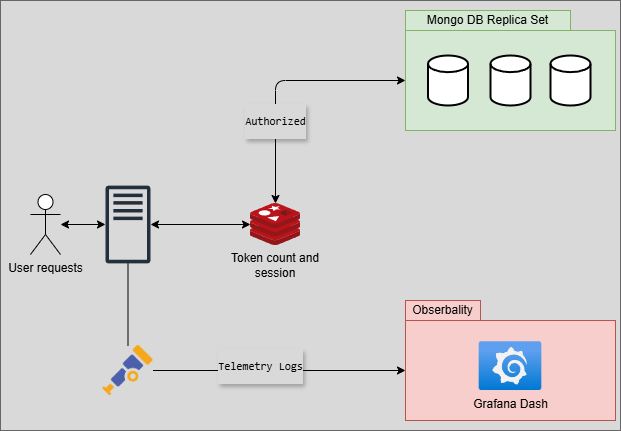

# Leaky Bucket Strategy

This project is a backend API that simulates the consultation of Pix keys using a **Leaky Bucket** strategy inspired by the BACEN's rate limiting rules. The system is built with **Node.js, Koa, TypeScript, Redis, MongoDB (Replica Set)** and **GraphQL (Code First with TypeGraphQL)**, following a **DDD** and **event-driven** architecture.

---

## 📦 Technologies

- **Node.js** + **Koa**
- **TypeScript**
- **GraphQL (Apollo / TypeGraphQL)**
- **Redis** (for session and request control)
- **MongoDB with Replica Set** (high availability and consistency)
- **JWT** for authentication
- **Jest** for testing
- **DDD + Event-driven architecture**

---

## 🧠 Leaky Bucket Strategy

Each user starts with **10 tokens** for consulting Pix keys.

- ✅ **If the key exists** → the token is maintained  
- ❌ **If the key is incorrect** → 1 token is consumed
- ♻️ **Every 1 hour** → the bucket recovers 1 token (maximum of 10)
- Tokens are persisted and controlled by **Redis**

---

## 🔐 Session and Authentication with Redis

After logging in, a **JWT** is generated and sent in the `Authorization: Bearer <token>` header. The middleware performs:

1. **Session validation and caching in Redis** (TTL of 1 hour)
2. **Automatic renewal of TTL for each valid request**
3. **Fallback to validation with `jwt.verify` if the token is not in the cache**

## 🗄️ The MongoDB Replica Set is used for:

- High availability
- Consistency support
- Failure tolerance

## 🛠️ Workers with BullMQ
The queues are declared in queue.config.ts, and the processors (workers) are decoupled by responsibility in user.workers.ts, pixKey.workers.ts, etc.

© Micael Vitor Felix Ferreira